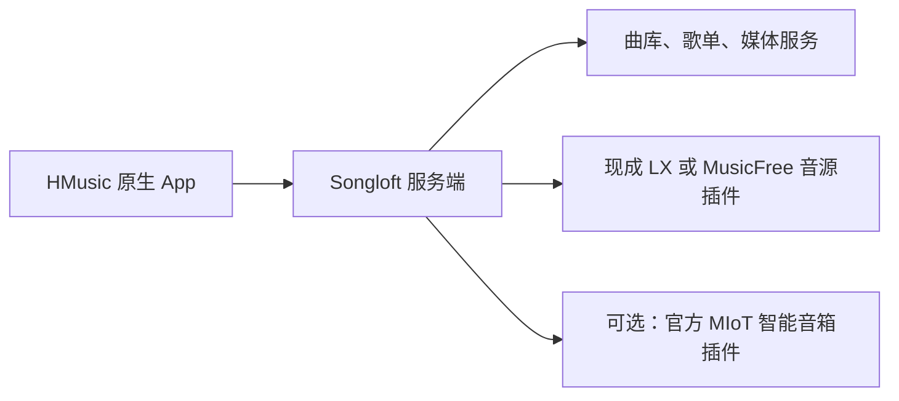

# 备选：HMusic App 直接适配 Songloft 的调研与接入方案

调研日期：2026-09-15（Asia/Shanghai）。状态：方案，尚未开始 App 改造。

当前优先级是保留 HMusic 自有实现、数据和业务主链路，主方案见 [保留 HMusic 的可选接入方案](songloft-hmusic-first-plan.md)。本文保留插件调研与客户端直连设计，仅用于未来主动选择 Songloft 后端的场景，不作为替换 HMusic-Server 的默认实施方向。

## 1. 备选模式目标

这一备选模式采用 **HMusic App → Songloft 标准 API → 已安装的音源插件**。

用户只部署 Songloft，在其商店安装现成的 LX 音源插件并导入自己使用的脚本，随后用 HMusic App 登录、搜索、管理歌单和播放。小米音箱控制按需接官方 MIoT 插件。

这条路线不要求迁移 HMusic-Server，也不要求安装或发布 HMusic Bridge。此前 `songloft-plugin/` 的桥接实现属于另一条使用路径，不能当作本方案已经完成的客户端适配。

建议以当前最新正式版 **Songloft v2.12.1** 为接入验收基线；该版本于 2026-09-14 发布。此前桥接测试使用的 2.12.0 结果不能替代新插件与新 App 的验收。



## 2. 现成插件调研

本次读取了官方默认源、社区聚合源、上游清单、GitHub Releases、部分实现和发布包。下表中的“支持”区分项目声明、源码实现与本次实测，不能仅凭版本号或商店收录判断真实音源稳定性。

| 项目 | 当前核对版本 / 发布日期 | 能力与部署方式 | 本方案定位 |
| --- | --- | --- | --- |
| [fly818 / LXMusic](https://github.com/fly818/lxmusic-plugin-release) | 3.7.20 / 2026-09-12 | 发布包内含 `jsenv` 权限、LX 脚本导入管理，以及搜索、URL 解析接口；属于宿主内运行的音源插件。使用者仍需导入音源脚本 | 首个验收候选；有现成安装包，但公开仓库以分发为主，缺少后端源码和接口文档 |
| [Starlight](https://github.com/snakejohn/starlight) | V-2026.08.29.12.07 / 2026-08-29 | 源码、API 文档和多次 Release 可见；支持 LX 脚本、搜索、歌单、榜单、内置 LX 列表同步与音箱控制；README 明确同步无需另部署 lxserver | 需要公开实现或更完整功能时的候选；接口较多，不能把它和 LXMusic 当作完全相同的实现 |
| [MFAdapter](https://github.com/Lirenjun11/MF-songloft-js) | 1.1.6 / 2026-08-28 | MusicFree 脚本适配器；源码实现 `getMediaSource`、搜索及 Songloft 音源接口，在插件环境内执行 | 替代音源生态候选。MusicFree 脚本格式与 LX 不同，不承诺直接导入 LX 脚本 |
| [官方 MIoT](https://github.com/songloft-org/songloft-plugin-miot) | 清单 2026.9.11 | 宿主插件代管小米账号、设备和音箱播放 | 音箱控制优先复用；App 只做客户端接入 |
| [官方 Subsonic](https://github.com/songloft-org/songloft-plugin-subsonic) | 2.2.3 / 2026-07-30 | 同时提供外部 Subsonic 库接入和对外 Subsonic API；服务端搜索实现检索 Songloft 已入库歌曲 | 适合通用曲库客户端。不能单靠它替代在线 LX 搜索和 MIoT 控制 |
| [GoMusicDL](https://github.com/songloft-org/songloft-plugin-go-music-dl) | 2026.9.9 / 2026-09-09 | 有持续发布，但使用文档要求填写本地或远程 `go-music-dl` 实例地址 | 不作为“只部署 Songloft”的默认方案；接受额外服务时再考虑 |

### 2.1 LXMusic 的获取方式

本次核对的官方默认 `registry.json` 中没有 LXMusic；社区聚合源已收录。可以在 Songloft 的“管理订阅源”中只添加作者源：

```text
https://raw.githubusercontent.com/fly818/lxmusic-plugin-release/main/registry.json
```

然后从商店安装“洛雪音源”，在该插件自己的配置页导入 LX `.js` 脚本。App 接入时只需连接 Songloft；音源脚本不要求由 App 执行。

需要浏览其他候选时，社区聚合源为：

```text
https://raw.githubusercontent.com/deerwan/songloft-plugin-market/main/registry.json
```

App 本身继续按 HMusic 原来的客户端渠道分发；Songloft 商店安装的是服务端插件。

### 2.2 已核实的限制

- LXMusic 3.7.20 的公开清单与 ZIP 内清单使用不同的 `updateUrl`。ZIP 内指向 `fly818/mimusic-jsplugin-lxmusic/main/plugin.json`，本次请求返回 404。安装后的更新链路必须验证，不承诺当前包自动更新正常。
- Starlight 文档说明普通入库会先解析并保存远程 URL。它与保留 `plugin_entry_path + source_data` 的歌曲有不同的过期恢复行为；需要检查目标版本的实际入库结果和重新解析路径。
- MusicFree 的插件接口、平台标识和返回格式与 LXMusic 不完全相同，首期不承诺适配所有第三方音源插件。
- 搜索能返回元数据，不代表导入的某个 LX 脚本能解析该平台或音质。需要用实际脚本验证搜索、解析、媒体 Range 和解码。
- 同名项目容易误判：`hanxi/songloft-plugin-lxmusic` 当前是 Prompt 仓库；`NeoHeee/songloft-plugin-lxbridge` 是备份解析和匹配工具。它们不能直接替代已运行的 LX 音源引擎。
- `skywolf520/songloft-plugin-lxmusic` 的说明及下载地址指向 `NeoHeee/songloft-plugin-lxmusic`；该目标本次返回 404。聚合目录中的 `fanliu-yi/go-music-js` 也返回 404，因此不把这些旧入口列为首期依赖。

## 3. 为什么推荐原生 Songloft API

两种接入方式都可研究，但针对 HMusic 当前用途，优先原生 API。

| 方式 | 适用范围 | 取舍 |
| --- | --- | --- |
| 原生 Songloft API + 少量插件适配 | 曲库、歌单、本机播放、在线搜索、MIoT 音箱 | 推荐。覆盖实际需要的能力，新增适配实现集中在 App 数据层 |
| Subsonic API | 已入库歌曲、歌单、普通音乐播放 | 可用于未来通用服务器支持；当前 App 同样需要新增协议实现，且在线搜索和音箱仍需额外接口 |

Songloft v2.12.1 的公开路由有歌曲、歌单、鉴权、插件管理和媒体播放，但没有 HMusic 式的 `/playback/*`、`/queue/*`，也没有一个公开的统一在线搜索端点。

宿主内部存在跨插件 `/api/search` 调用，用于解析和候选发现；这不等于 App 可以调用一个未公开的聚合搜索 API。客户端需要针对验收过的音源插件调用其 HTTP 路由。

## 4. App 的改造范围

现有 App 已有 Server / direct 后端、Repository 接口、`RoutedPlaybackRepository`、本地队列实现和统一音频 Handler。这些可以复用。

| 模块 | 改造内容 | 可复用部分 |
| --- | --- | --- |
| 连接与会话 | 增加 Songloft 服务类型、版本探测、登录、双 Token 刷新；会话按服务类型及地址隔离 | 连接页布局、安全存储、会话失效协调 |
| 网络与错误 | 在网络层处理 Songloft 响应封装、Token 刷新及插件错误；页面继续通过仓库访问 | 现有分层、错误展示与请求代际保护 |
| 曲库与歌单 | 接 `/songs`、`/playlists`，映射分页、歌曲 ID、时长、封面及收藏行为 | 现有列表、详情、歌单编辑界面 |
| 在线搜索 | 首期只接一个通过验证的 LXMusic 实现，保留来源原始数据；以后按实际需求加入 MF 或 Starlight | 搜索页、曲目展示、播放操作 |
| 本机播放 | 加载 Songloft 媒体入口，处理鉴权、Token 过期、seek、重试 | `audio_service`、`just_audio`、锁屏和原生界面 |
| 本机队列 | 由 App 持有当前队列与播放位置，后台 Handler 推进下一曲 | 现有本地队列算法及命令串行机制；存储与 direct 模式隔离 |
| 音箱 | 接官方 MIoT 设备、状态、队列及播放控制 | 设备选择和播放器界面 |
| 扩展功能 | 榜单、源管理、下载、统计按选定插件的真实能力分别接入 | 对应页面可复用；能力缺失时明确展示状态 |

App 改造判断为中等规模，主要集中在后端协议和播放状态接入。要求所有 HMusic 专属能力逐项等价时，范围会继续扩大；客户端接入不自动实现 HMusic 的 Spotify 登录、现有下载任务、历史数据迁移或两套服务器间的数据同步。

## 5. 接口与状态约定

### 5.1 基础接口

以下路径均相对 Songloft 服务地址：

| 用途 | 接口 / 约定 |
| --- | --- |
| 版本 | `GET /api/v1/version` |
| 登录与刷新 | `POST /api/v1/auth/login`、`POST /api/v1/auth/refresh` |
| 已入库歌曲 | `GET /api/v1/songs`，关键字参数 `keyword`，分页 `limit/offset` |
| 歌单 | `/api/v1/playlists`、`/api/v1/playlists/{id}/songs` |
| 在线搜索 | 选定插件的 `/api/v1/jsplugin/{entryPath}/api/search`，以实测请求与响应为准 |
| 入库 | `POST /api/v1/songs/remote`，保存插件标识、原始 `source_data` 和稳定去重键 |
| 媒体播放 | `GET /api/v1/songs/{id}/play`，按宿主要求附带媒体访问凭据 |
| 歌词 | `GET /api/v1/songs/{id}/lyric` |
| 播放事件 | `POST /api/v1/songs/{id}/played`；不是 HMusic 的状态同步或队列推进接口 |
| 插件状态 | `GET /api/v1/jsplugins`；已安装、启用、脚本已导入、实际可播需分别判断 |

### 5.2 实现约束

1. **区分未入库搜索结果和宿主歌曲 ID。** 搜索时不批量污染曲库；用户播放或收藏时再按目标插件契约入库。宿主歌曲 ID 与平台歌曲 ID 分开保存。
2. **保留原始来源数据。** `source_data` 作为不透明数据保存并按宿主要求序列化，不能只保存临时 CDN URL；去重必须基于可靠的平台身份，不能只比较歌名。
3. **本机队列归 App。** 歌单由 Songloft 保存；当前播放顺序、进度与后台下一曲由 HMusic Handler 管理。不能继续向不存在的 HMusic `/local-report` 请求下一首，也不承诺同步另一个客户端的本机播放队列。
4. **音箱队列归选定的音箱后端。** 使用 MIoT 的服务端队列，避免依赖手机退后台后的 Timer。设备切换要停止旧目标并确认状态。
5. **复用音频引擎，调整协议边界。** 现有 Server URL 校验只接受 `/api/v1/proxy/`，必须为 Songloft 提供对应规则。服务凭据不能跟随媒体跳转泄漏给音乐 CDN。
6. **复用现有仓库接口。** 新增实际需要的 Songloft 实现；不把 HMusic App 改成插件 WebView，也不复制官方客户端整套播放器。
7. **插件能力按已验证实现匹配。** 不只凭 `entryPath=lxmusic` 认定兼容；不同作者的插件可能占用同一名称。网络超时、插件禁用、未导入源及源解析失败分别呈现。
8. **模式与账号隔离。** 切换后端沿用现有停止、持久化、代际检查机制；迟到的旧请求不能污染新队列或清理新会话。

## 6. 执行顺序与验收

### 阶段 0：先验证一个可用音源组合

在隔离 Songloft 2.12.1 实例中验证 LXMusic 3.7.20。使用实际计划支持的 LX 脚本，核对初始化、来源、音质和超时。最少覆盖：

- 配置持久化、插件重载、启用与禁用；
- 目标平台的搜索 → 入库 → 宿主播放，核对歌曲归因；
- 媒体 Range/206、seek、带 headers 的资源；
- 旧 URL 失效后的重新解析、失败重试；
- 包内更新地址的处理及安装后的更新检查；
- 全程不依赖 HMusic-Server。

产出固定版本、接口样例、实际成功与失败记录。若该包无法满足要求，先验收 Starlight 或 MF 候选，再决定是否值得修补；不立即回到全面迁移 HMusic-Server。

### 阶段 1：完成 App 基础播放闭环

实现 Songloft 登录、曲库、歌单、歌词、本机队列、播放/暂停/seek、后台下一曲及锁屏控制。先使用宿主中已存在的歌曲，隔离音源插件问题。

验收包含 Token 刷新、网络中断、后台连续播放、冷启动恢复和后端切换。Android/iOS 后台能力按 App 项目要求做真机验证。

### 阶段 2：把在线搜索接进 HMusic 原生界面

接阶段 0 选定插件的搜索、分页、来源信息、入库和播放；收藏写入 Songloft 歌单。插件安装和脚本初次配置先在 Songloft 管理页完成。

验收“App 搜索 → 点击播放 → 收藏 → 重启后播放”，并核对重复点击不重复入库、过期链接恢复、不支持的平台和空音源提示。

**阶段 0–2 完成后，即可交付“只部署 Songloft，使用 HMusic App 搜索和听歌”的基本目标。**

### 阶段 3：音箱与按需扩展

需要小米音箱时接官方 MIoT，包括设备选择、实际发声、队列推进、状态同步、手机退出后的连播。源管理、榜单、下载和统计根据使用优先级接入对应插件；不预先重做整个插件商店。

## 7. 本次已做与未做的验证

已完成公开源与 Release 检索、清单比对、源码/接口阅读，以及三个安装包的实际下载、ZIP CRC 和入口哈希检查：

| 安装包 | SHA-256 |
| --- | --- |
| LXMusic 3.7.20 | `0e3f6ec8403279833d1d76e8fcb5878817b811f57a399ddba4704601ce78d1ae` |
| Starlight V-2026.08.29.12.07 | `cc080f1eb8276aa0003b9bdff01f7ea852aec239c8eff23d45e47be4eff33788` |
| MFAdapter 1.1.6 | `9ef730f3418ca4905557739bd787f567040f19dc144fc385fec398671bb639ae` |

三个包的 CRC 与 `main.jsc` 入口哈希均通过。安装包结构、前端路由和入口字节码中能确认相应接口信息；这些检查不能证明插件已在目标宿主运行成功。

本轮未安装这些插件、未导入真实 LX/MF 脚本、未测试其真实音频，也未修改 App 或发布任何软件。阶段 0 的运行验收仍需执行。未来 App 代码变更按其 `AGENTS.md` 完成文档更新、格式检查、静态分析、必要测试和真机验证。

## 8. 主要参考

- [Songloft v2.12.1](https://github.com/songloft-org/songloft/releases/tag/v2.12.1)
- [v2.12.1 OpenAPI](https://github.com/songloft-org/songloft/blob/v2.12.1/docs/swagger.json)
- [v2.12.1 路由实现](https://github.com/songloft-org/songloft/blob/v2.12.1/internal/app/routers.go)
- [宿主音源搜索协议](https://github.com/songloft-org/songloft/blob/v2.12.1/internal/services/source/resolver.go)
- [官方插件源](https://github.com/songloft-org/songloft-plugin-registry/blob/main/registry.json)
- [社区聚合目录](https://github.com/deerwan/songloft-plugin-market/blob/main/data/plugins.generated.json)
- [LXMusic 3.7.20 发布包](https://github.com/fly818/lxmusic-plugin-release/releases/tag/3.7.20)
- [Starlight API](https://github.com/snakejohn/starlight/blob/main/docs/starlight-plugin-api.md)
- [MusicFree 适配实现](https://github.com/Lirenjun11/MF-songloft-js/blob/master/src/main.ts)
- [Subsonic 服务端搜索与媒体实现](https://github.com/songloft-org/songloft-plugin-subsonic/blob/main/src/server/index.ts)
- [GoMusicDL 配置要求](https://github.com/songloft-org/songloft-plugin-go-music-dl/blob/main/docs/usage.md)
- [App 现有播放后端路由](../../HMusic-App/lib/core/audio/routed_playback_repository.dart)
- [App 现有本地队列](../../HMusic-App/lib/core/queue/direct_queue_repository.dart)
- [App 现有媒体 URL 规则](../../HMusic-App/lib/core/audio/stream_url_rebaser.dart)
