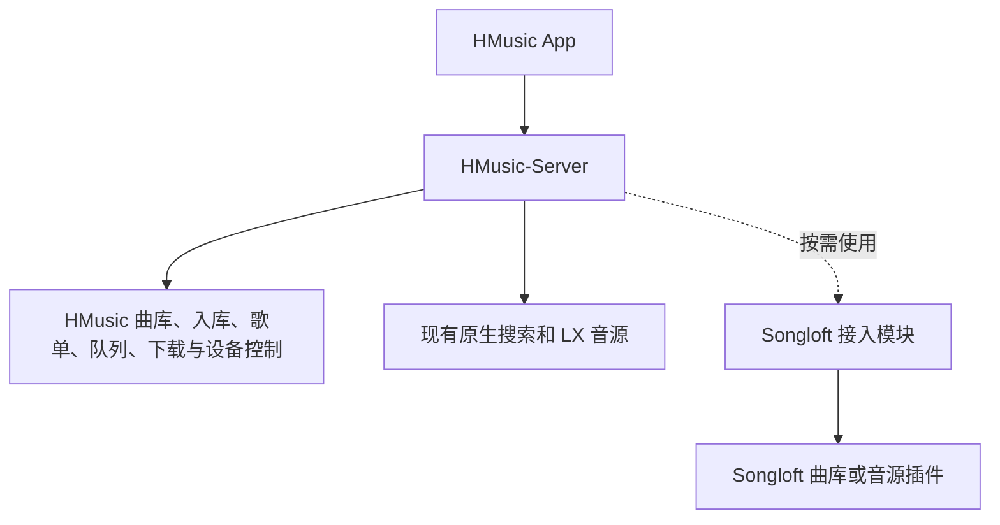

# 保留 HMusic 主链路的 Songloft 可选接入方案

日期：2026-09-15。状态：方案，尚未实现反向接入。

## 1. 产品前提

保留 HMusic App 和 HMusic-Server 已经实现的入库、曲库、歌单、队列、音源、代理、下载、设备控制与数据。Songloft 仅作为可选的外部能力，不要求 HMusic 为了兼容它替换整套业务。

当前推荐：**HMusic App 继续调用 HMusic-Server；由 Server 在需要时接入 Songloft 曲库或音源插件。**

“用户只运行 Songloft”与“现有 HMusic-Server 代码继续原样承担业务”不能同时成立。此方案需要 HMusic-Server。若希望简化部署，可以后续提供一次启动两个服务的部署配置，但不能把它描述成只有 Songloft 一个服务。

## 2. 职责划分

| 能力 | 继续负责的一方 | Songloft 的可选作用 |
| --- | --- | --- |
| App API、界面、播放操作 | HMusic | 不替换业务协议 |
| 扫描、上传、下载后入库 | HMusic-Server | 可以提供额外的曲目与音频来源 |
| 收藏、歌单、历史、当前队列 | HMusic 数据库及服务 | 不作为这些数据的主存储 |
| 本机后台播放和锁屏控制 | HMusic App | 提供媒体，不接管客户端播放状态 |
| 音源搜索与解析 | 现有实现继续工作，按需增加外部来源 | 提供已经验证的曲库或插件能力 |
| 小米账号、设备控制与连播 | HMusic 原有实现 | 初期不再同时接管同一设备 |

引入 Songloft 应针对实际缺少的能力。HMusic 已经具备的原生搜索、LX 运行时或曲库功能，不需要因为其他项目也有实现就更换。

## 3. 歌曲入库如何保留

当前代码已有两条不同的路径：

- `playlists.service.ts` 的 `upsertStoredTrack` 按 `source + sourceTrackId` 匹配曲目，保存元信息与 `rawJson`，用于收藏和歌单。
- `library.service.ts` 管理扫描、上传、下载得到的本地文件；下载服务完成后调用 `upsertFromDownload` 入库，播放通过 HMusic 自己的代理地址。

外部歌曲接入时复用这两条路径：

1. 读取 Songloft 中选定歌曲的元信息，转换为 HMusic 的曲目模型。
2. 为外部连接和歌曲建立稳定身份映射，保留可再次定位歌曲的引用。
3. 用户收藏或加入歌单时，写入 HMusic 自己的曲目与歌单表。
4. 播放时由接入模块取得当前媒体入口，再交给 HMusic 的解析、代理和播放链路。
5. 用户选择下载到 HMusic 时，完成下载后进入现有本地曲库。

登记一首远程歌曲与把音频文件保存到本地是两件事。不能仅写入一个过期直链，就声称已获得独立于上游的本地歌曲。

HMusic 自己的曲目身份不能直接被不同 Songloft 实例的数字 ID 覆盖；凭据仅由服务端接入配置管理，不能放进 App 可读的曲目 `raw` 或永久保存的媒体 URL。

## 4. 需要新增的工作

此接入尚不存在，不能只改配置地址就使用。目前 `HMusicSource.type` 只包含 `manual` 和 `lx_js`，搜索、解析和歌词还需要增加外部来源分流。

改动重点放在 Server：

- Songloft 连接配置、认证及连接身份；
- 外部歌曲到 `HMusicTrack` 的映射与去重；
- 来源解析、媒体鉴权、headers、超时及失效恢复；
- 接入现有歌单、下载与本地入库链路；
- 上游不可用时隔离失败，保持原有音源与本地文件走原路径。

App 保留现有 API 与主要播放流程。需要的变化预计集中在外部来源配置、来源名称或浏览入口；具体兼容性需要在实现时检查，不能预先承诺零改动。

先接 Songloft 已入库歌曲，再根据实际缺口考虑调用第三方插件的在线搜索。不一开始实现所有插件的通用适配。

## 5. 与现有 HMusic Bridge 的关系

- **已经实现的方向**：Songloft → HMusic Bridge → HMusic-Server。它让 Songloft 使用 HMusic 能力，HMusic App 仍连接自己的服务端。
- **本方案新增的方向**：HMusic-Server → Songloft 曲库或音源插件。它让 HMusic 使用额外来源。

两者不是同一个接入。新增方向不能再把 `hmusic-bridge` 当成上游音源；需要限定调用对象并处理递归，避免 HMusic 与 Songloft 在搜索、解析或换源时互相回调。

若当前只是希望 Songloft 用户也能使用 HMusic，已有桥接方向已经符合“保留 HMusic 实现”的架构，无需因此新增反向接入。

## 6. 最小验证范围

第一步只验证：从 Songloft 读取一首歌 → 在 HMusic 中收藏 → 用现有 HMusic App 播放 → 下载进入 HMusic 本地曲库 → 重启后仍可访问。

同时核对重复导入、上游凭据更新、链接过期、Range/seek，以及停用外部连接后 HMusic 原有音源和本地曲库的行为。通过后再决定是否扩大到在线搜索、更多插件或部署打包。

若仍坚持用户只运行 Songloft，则必须另行评估把需要的 HMusic 服务端业务移植到插件，或把 HMusic 服务一并打包启动。保留业务行为是可行目标，但不能省略承载这些行为的代码和运行环境。

## 7. 参考

- [Songloft 插件调研与可选客户端直连方案](songloft-client-adaptation-plan.md)
- [已实现的 HMusic Bridge](../songloft-plugin/README.md)
- [现有歌单存储](../src/modules/playlists/playlists.service.ts)
- [现有本地曲库](../src/modules/library/library.service.ts)
- [现有下载服务](../src/modules/downloads/downloads.service.ts)
- [现有来源与解析](../src/modules/sources/sources.service.ts)
